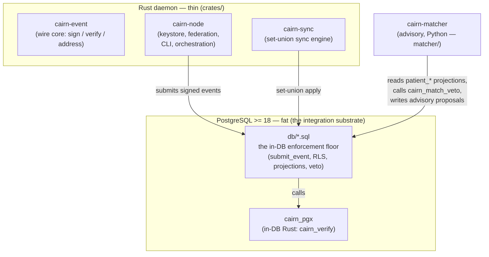

# Architecture for developers

This page gives you the **mental model** you need before the code reads as anything but a pile of
files. It is a developer-oriented summary, not the authority — the authority is the
[architecture spec](../spec/index.md) (one file per aspect) and the [ADR log](../spec/decisions/README.md)
(the *why*, immutable). Read this, then dive into the [Codebase tour](codebase-tour.md).

---

## 1. The one idea everything hangs from: an append-only, signed event log

Cairn does **not** store clinical data as rows you `UPDATE` and `DELETE`. It stores an **append-only
stream of immutable, signed events**. A correction is a *new* event that references the original; an
identity error is repaired by a *new* link/unlink event. Nothing is ever erased or mutated in place.

Why this matters to you as a developer:

- **Sync becomes safe.** Because events are immutable and content-addressed, synchronizing two nodes
  is a **set union** plus a small, explicitly enumerated set of clinically-reasoned merge policies —
  never a dangerous field-level merge. (This is principle 1; see the
  [sync spec](../spec/sync.md).)
- **The "current state" you query is a projection.** Tables like `patient_identifier`,
  `patient_name`, `patient_demographic` are *derived* from the event log by triggers/functions. They
  are caches of the log, rebuildable from it. You never write them directly — you submit an event and
  the projection updates.
- **Ordering is by Hybrid Logical Clock (HLC), not wall-clock.** Events carry an HLC so causal order
  survives clock skew across offline nodes. See the [Glossary](glossary.md#hlc-hybrid-logical-clock).

The four governing principles below are the lens **every** change is checked against. Internalize the
first four before writing code — the full twelve are in [spec/index.md](../spec/index.md).

1. **Append-only + causal ordering** — immutable signed events, HLC-ordered; corrections overlay.
2. **Identity is a claim, never a fact** — *never merge, always link; never erase, always overlay.*
   Patient UUIDs are immortal.
3. **Paper-parity (governing law)** — no workflow may be slower/harder/impossible than its paper
   equivalent. **Confirmation dialogs are explicitly not an acceptable safety mechanism.**
4. **Acknowledged uncertainty** — *unknown*, *not-yet-asked*, *refused*, ranges, and imprecision are
   first-class values. No required field may be satisfiable only by fabrication.

---

## 2. Fat Postgres, thin daemon

The safety-critical logic does **not** live in application code where many clients could each get it
subtly wrong. It lives **inside PostgreSQL** — as validated `SECURITY DEFINER` functions, row-level
security, constraints, and triggers — so that *even a client connecting with raw SQL cannot break the
record.* The Rust daemon (`cairn-node`) is deliberately thin: it does crypto, transport, and
orchestration, then calls into the database.

This is [ADR-0001](../spec/decisions/0001-fat-postgres-thin-daemon.md), and it is *why the `db/`
directory is the heart of the codebase*, not a schema afterthought.

The practical consequence — **the integration boundary is the database boundary.** Components talk to
their node's PostgreSQL; they do not link to each other via FFI. The Python matcher, the Rust daemon,
and any future UI backend all meet *at the database*.

---

## 3. The four-layer model

Cairn is layered so that the thing that makes any node interoperable with any other — the signed
event core — sits **below** everything that is allowed to vary
([ADR-0021](../spec/decisions/0021-layering-the-node-api-and-ui-pluralism.md), principle 12). From
the bottom up:

| Layer | What it is | Where it lives in the repo |
|---|---|---|
| **1. Wire core** | the signed, append-only event: serialization (canonical CBOR), COSE_Sign1/Ed25519 signature, content-addressing, the identity/actor algebras. **Nothing above this sits on the inter-node path.** | `crates/cairn-event` (+ the in-DB `cairn_verify` in `extensions/cairn_pgx`) |
| **2. Node enforcement floor** | the **unbypassable** safety floor enforced *in the database*: the validated `submit_event` door, RLS, constraints, projection triggers, the matcher hard-veto. | `db/*.sql` |
| **3. Policy + native API** | hard policy (DB-anchored / role-gated) and the node's native API. Evolves additively. | (early; not yet built out) |
| **4. UI** | soft policy and presentation; many front-ends, one record. | (out of scope of the current build) |

A bespoke UI can produce content that is *wrong for its clinic* but **never a wire-incompatible
event**, because the compatibility boundary is below the application. "Via the API vs. raw SQL" is a
**privilege gradient, not a contradiction** — the floor holds either way. This was proven against a
hostile agent in [Spike 0002](../spikes/0002-advisory-actor-write-contract.md).

---

## 4. The pieces, and how they meet at the database

- **`cairn-event`** — the safety-critical wire core. Signs the *bytes* and never re-serializes for
  verification; multihash content-addressing carries the algorithm with the digest. Small and kept
  reviewer-legible on purpose.
- **`cairn-sync`** — the set-union synchronization engine.
- **`cairn-node`** — the thin federation daemon: Ed25519 keystore (sealed at rest), pairing/mTLS,
  set-union `node_event` sync, backup/restore/supersede, and the demographics build surface. Its CLI
  is the main developer entry point (`cairn-node init`, `status`, `peers`, `backup`, `restore`, …).
- **`db/`** — the numbered migrations that *are* the enforcement floor (layer 2). This is where the
  clinical product is being built, slice by slice.
- **`cairn_pgx`** — the small Rust extension that runs inside Postgres (signature verification).
- **`cairn-matcher`** — the advisory probabilistic patient-matcher. It only **scores and proposes**;
  it can never auto-link or auto-reject. The hard, safety-critical *veto* lives in the database
  (`db/016_match_veto.sql`), not in Python.

---

## 5. Choosing a language: defect blast radius

When you add code, the spec does not tell you *which language* by component — it tells you the
**rule** ([spec §9](../spec/language-substrate.md),
[Governance §3](../principles/GOVERNANCE.md#3-how-decisions-are-made)):

> **Choose by what a defect can do.**

- **Safety-critical** — a defect could silently corrupt the record, mis-merge patients, leak data, or
  crash an unattended node → **Rust or in-database (SQL / PL-pgSQL / pgrx)**, optimized above all for
  **reviewer-legibility**, and kept as small as possible. Members: the sync/merge engine, the
  identity event algebra, HLC ordering, the matcher *veto*, access control, audit-log integrity.
- **Fit-for-purpose** — a defect is caught immediately, is advisory, or is cosmetic → optimize for
  iteration speed (Python/ML). Members: the probabilistic matcher *scoring*, the FHIR façade,
  integration glue, UI backends.

This is why the matcher's *veto* is in SQL but its *scoring* is in Python — same subsystem, two
different blast radii.

---

## 6. A write, end to end (the worked example)

Follow a single **patient-identifier assertion** (demographics slice 1) from Rust to a queryable
projection. This is the path the [Codebase tour](codebase-tour.md) reads in source:

1. **Build the event body (Rust, `cairn-event::demographics`).** A pure builder produces the event
   body *and* its mandatory plaintext **legibility twin** — a signed, mechanically-derived
   human-readable rendering carried in the body so the event stays readable forever, even on a node
   that doesn't understand its schema (principle 11; the twin is the
   [Glossary](glossary.md#legibility-twin) entry).
2. **Sign the bytes (`cairn-event::sign`).** The body is canonical-CBOR-encoded and wrapped in a
   COSE_Sign1/Ed25519 blob. *Those exact bytes* are what gets stored and verified — never a
   re-serialization.
3. **Submit through the validated door (`db/005_submit.sql` → `submit_event`).** This is the only
   write path into the event log. It calls the in-DB `cairn_verify` (from `cairn_pgx`) to check the
   signature, runs the structural floor checks for the event type (e.g.
   `cairn_check_identifier_assertion` in `db/010`), and appends to the immutable `event_log`. A raw
   SQL client cannot bypass this — RLS + the `SECURITY DEFINER` door enforce it.
4. **Project (trigger in `db/010_demographics.sql`).** A trigger scoped to the demographic event type
   folds the new event into the `patient_identifier` projection as a **set-union** (`ON CONFLICT DO
   NOTHING`), so applying the same event twice — or learning it from two peers — converges.
5. **Query the projection.** `patient_identifier` now answers "what identifiers does this patient
   have?" — a cache of the log, rebuildable from it at any time.

Every demographics slice (DOB, names, sex/gender, address) follows this same spine, with a different
projection-winner policy per field. That repetition is the point: once you understand one slice, you
understand them all. The tour walks the actual files.

---

## Next

**[Repository map →](repository-map.md)** to see where everything lives, or jump straight to the
**[Codebase tour →](codebase-tour.md)** to read the worked example in source.
