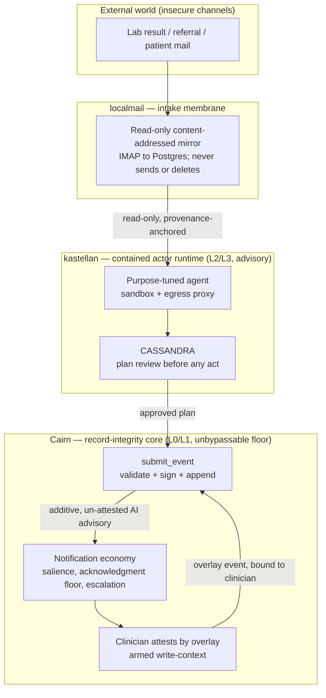

# Ecosystem evaluation — agent & messaging plugins (kastellan, localmail)

**Date:** 2026-06-18
**Status:** Evaluation. Spec unchanged (**v0.26**); no ADR minted. One ADR-worthy refinement is **parked**
(skill-epoch as a pinned actor determinant → a future [ADR-0011](../spec/decisions/0011-actor-registry-version-pinning-and-key-custody.md)
refinement, to ratify when integration is actually committed).
**Subjects:** [kastellan](https://github.com/hherb/kastellan) — a security-first personal AI agent (Rust, AGPL-3.0) ·
[localmail](https://github.com/hherb/localmail) — a read-only IMAP→Postgres mirror (Python, AGPL-3.0).

> [!NOTE]
> This is an **ecosystem evaluation** — not architecture and not a decision. Like a [spike](../spikes/README.md)
> record it captures *what we looked at and what we concluded*, keeping the spec a clean *what* and the ADR log a
> clean *why*. Both projects are **optional extensions**: a bare Cairn node is a complete EHR without either, and
> neither sits on the inter-node path, so neither can compromise interoperability or the safety floor even if it
> fails — exactly the posture founding principle 12 (*uniform core, plural edges*) requires.

---

## 1. Synthesis — three membranes, nested chokepoints

The two projects are not unrelated tools. Together with Cairn they form a **three-membrane ingestion-and-action
stack**, each membrane owning a *different* safety chokepoint, and the chokepoints **nest** rather than overlap:

1. **localmail — the quarantined intake membrane.** Turns an insecure external channel (mail; generalizable to any
   messaging) into a read-only, content-addressed, provenance-anchored, queryable mirror. Governs *what gets in*.
2. **kastellan — the contained actor runtime.** Lets an AI agent read that mirror and the record, reason/browse/
   compute, and *propose* clinical actions — with sandbox + egress control + CASSANDRA semantic plan-review
   containing what the agent does *in the world*. Governs *what the agent may do*.
3. **Cairn — the record-integrity core.** Decides what becomes a clinical fact, how it is attributed, surfaced, and
   recalled. Governs *what becomes truth*.

Each owns a distinct chokepoint; none is on the inter-node path; together they let the rigid, safety-critical core
stay rigid while the messy outside world (mail, web, compute, AI) is handled at arm's length and contained. That is
the user's thesis — *infrastructure to make the EHR flow without compromising security needlessly* — made concrete:
the rigour sits at the membranes, never as friction on the clinician.

---

## 2. Where each lands in the layer model

Cairn's layering ([ADR-0021](../spec/decisions/0021-layering-the-node-api-and-ui-pluralism.md) /
[§9.5](../spec/language-substrate.md)) is **L0** wire/event core (uniform, the sole inter-node contract) · **L1**
in-DB enforcement floor (fat Postgres, unbypassable) · **L2** policy + native API (plural) · **L3** UI (plural).
Both projects are **L2/L3 components that consume the native node API and write back only through `submit_event`**
([ADR-0022](../spec/decisions/0022-validated-submit-surface-the-write-path.md)) — the same public-API-only
discipline Cairn imposes on its *own* reference UI.

- **localmail** → an **ingestion adapter at the boundary skin** ([§3.4](../spec/data-model.md), the FHIR-façade
  tier). It never writes clinical events itself; it delivers raw, provenance-anchored material that a matcher /
  ingestion step turns into proposed events.
- **kastellan** → an **execution-containment runtime for the advisory tier** ([§9.1](../spec/language-substrate.md)
  "fit-for-purpose" bucket — defect caught immediately, advisory, never on the safety-critical path). The spec
  already declares the matcher and any AI advisory and forbids them from deciding; what it does *not* specify is
  *how you contain an agent that browses the web and runs generated code*. Kastellan is precisely that missing piece.

Both honour the rule that **the integration boundary is the database boundary**
([§9.3](../spec/language-substrate.md)): both already use Postgres as their substrate, so they couple to a Cairn
node through Postgres + the native API, with no FFI.

---

## 3. kastellan — a contained actor runtime for the advisory tier

### 3.1 What it is

A 17-crate Rust workspace, **AGPL-3.0-only**, with the same dependency-license discipline Cairn demands (it
explicitly excludes CDDL/BUSL/SSPL/Elastic). Sandboxed tool execution (bubblewrap/Landlock/seccomp on Linux,
Seatbelt on macOS); a **single dispatcher chokepoint** through which every tool invocation flows (policy + audit);
an egress proxy with credential-leak scanning; Postgres-backed memory; a Matrix operator channel; OpenAI-compatible
served-model backends (vLLM/llama.cpp/Ollama/remote); and **CASSANDRA** — semantic review of every plan against a
small set of constitutional constraints *before* execution. Primary host is the DGX Spark class of node.

### 3.2 Alignment — on the things hardest to retrofit

- **License & substrate.** AGPL-3.0; Rust + in-Postgres — exactly Cairn's safety-critical bucket
  ([§9.1](../spec/language-substrate.md)). The whole project optimises for the property Cairn names as its primary
  quality metric: **reviewer-legibility**.
- **The dispatcher chokepoint rhymes with `submit_event`.** Kastellan independently arrived at "one audited function
  through which every action flows" as its safety primitive; Cairn did the same for every write. They nest:
  kastellan's dispatcher governs the agent's *actions*; when one action is "record a clinical finding," it flows out
  of kastellan and into Cairn's `submit_event`. The audit logs nest too.
- **CASSANDRA and Cairn's record-safety model are complementary, not redundant.** CASSANDRA gates *what the agent
  does in the world*; Cairn's additive-vs-suppressing classification
  ([ADR-0010](../spec/decisions/0010-additive-vs-suppressing-classification.md)), attestation separation
  ([ADR-0007](../spec/decisions/0007-authorship-and-accountability.md)), and safety projection
  ([ADR-0006](../spec/decisions/0006-visibility-scope-replication-and-the-safety-projection.md)) gate *what enters
  the record and how it is attributed*. Two chokepoints on two different risks.

### 3.3 The one principle collision, and its resolution

CASSANDRA's constraint "no irreversible action without human verification" must gate the **agent's external/
autonomous actions**, *not* import a confirmation dialog into the **clinician's** workflow — Cairn's principle 3
explicitly bans confirmation dialogs as a safety mechanism ([vision §1.2](../spec/vision.md); they fail
paper-parity). The resolution is already latent in Cairn's canon and turns the collision into harmony: a kastellan
triage emits an **additive, AI-authored, un-attested event** — contributor set `{agent, triaged}`, no responsibility
held (signature ≠ attestation, [ADR-0007](../spec/decisions/0007-authorship-and-accountability.md)) — that *raises
salience, hides nothing, auto-acts on nothing irreversible*
([ADR-0010](../spec/decisions/0010-additive-vs-suppressing-classification.md)). A human attests later by overlay at
point of care. Stated that way, CASSANDRA's "no irreversible act without a human" and Cairn's "AI is additive, never
suppressing, never auto-acting" are the **same rule from two angles**.

### 3.4 Scaling — single-occupancy is a feature, not a ceiling

The instinct that "single-user = can't scale" is wrong here, because the heavy resource is the **served models**, not
the orchestrator:

- Kastellan-the-orchestrator is thin (agent loop, dispatcher, sandbox, audit). The GPU-heavy part is the served
  models behind the OpenAI-compatible boundary, and that tier **scales horizontally on its own**, independent of how
  many kastellan instances exist. The deployment shape is **N thin single-occupant instances → one shared serving
  fabric**, not "one kastellan that must learn multi-tenancy."
- Single-occupancy then becomes a **quality** property: a per-workflow instance can crystallise skills and habits a
  multi-tenant agent would smear across principals. Specialisation is the goal; multi-tenancy would degrade it.
- **A "user" need not be a clinician.** A purpose-tuned pathology-import pipeline is, in Cairn's vocabulary, exactly
  **one registered actor** ([ADR-0011](../spec/decisions/0011-actor-registry-version-pinning-and-key-custody.md)):
  its standing config (model, system prompt, tool set, RAG wiring) is the pinned identity; it authors additive,
  un-attested advisories; and the clinician never meets it on a Matrix channel — the advisory lands in Cairn's
  notification economy ([ADR-0009](../spec/decisions/0009-notification-economy-salience-routing-and-the-acknowledgment-floor.md)),
  where it is acknowledged, escalation-laddered, and paper-parity-checked. The result is a **fleet of specialist
  actors** (path-triage, referral-routing, med-rec), each thin, each its own version-pinned identity, all sharing the
  serving fabric.

> [!NOTE]
> This dissolves the channel-overlap concern. **Matrix is the operator/admin surface** for whoever tends a pipeline;
> the **clinical surface is Cairn's notification economy** — clinical acknowledgment must never route through a
> mutable mailbox, which Cairn deliberately rejects.

### 3.5 Accountability routes to the deployer

A purpose-tuned agent's responsibility, *if* policy ever assigns any
([ADR-0007](../spec/decisions/0007-authorship-and-accountability.md) default is none), routes via `on_behalf_of` to
whoever deploys and tunes it — the pathology service or facility — **never** to a clinician who only ever saw an
advisory. The clinician attests their *own* action by overlay; they never inherit the agent's.

### 3.6 Two operational seams to get right

1. **Crystallised skill-state needs a version stamp, or contamination-cascade recall goes fuzzy.** Kastellan's design
   already prevents *drift*: no skill executes before it is user-approved and **pinned**, and pinning mints a new
   actor. Because the model parameters and harness are fixed, "learning" here is not weight drift — it is distilling
   a repeated, well-rated run into a *named, frozen protocol*, moving toward determinism and reviewability. That maps
   onto [ADR-0011](../spec/decisions/0011-actor-registry-version-pinning-and-key-custody.md) with nothing left over:
   a crystallised skill is a content-addressable artifact, so its **digest becomes one more pinned determinant of the
   actor identity** (plausibly under the existing "tool & RAG config" line). Then *"which advisories did this agent
   author under skill-set v3?"* stays a first-class query, and if a *skill* — not the model — is later found wanting,
   the contamination cascade bounds recall to exactly that skill epoch. **This is the one ADR-worthy refinement** (see
   §8); the skill-promotion act is itself the audited supersession event (who battle-tested it, on what evidence, who
   approved the pin).

2. **The shared serving fabric must not silently mutate what a pinned actor claims to be.**
   [ADR-0011](../spec/decisions/0011-actor-registry-version-pinning-and-key-custody.md) pins "weights reference +
   inference config" into the actor identity. If ops upgrades the inference backend under the hood, every kastellan
   actor pointed at it is now mis-describing itself unless that swap forces a supersession. So the served model
   version must be **observable and pinned per-actor** — the advisory event records the model digest it actually ran
   against, not just a logical endpoint name. That is the price of the decoupling that buys the scaling.

> [!NOTE]
> **Drift vs. staleness.** Pinning eliminates *drift* (the model wandering). It is *correctly silent* about
> *staleness* (the world moving under a frozen skill — a new assay, a changed reference range, a novel organism).
> Staleness is closed one layer up by the **same** machinery: the advisory is additive, un-attested, and
> human-reviewed (a stale-skill misfire is caught, never corrupts the record), and a "flagged well-done" loop will
> not crystallise a skill for inputs it is currently failing — so adapting to a new distribution must resurface as a
> *new* skill through the same approval gate. Two failure modes, two homes, both covered.

### 3.7 Maturity & verdict

The architecture doc is explicitly a "skeleton, will grow"; CASSANDRA's implementation detail is partly withheld;
email failover is "not yet implemented." The **design** aligns strongly; the **implementation** is young. Treat
kastellan as the **co-developed execution-containment layer for Cairn's advisory tier**, deployed per-clinician /
per-pipeline first. The named pieces of work are actor-registration (§3.6) and the two operational seams — *not*
multi-tenancy, which the single-occupancy + served-fabric model makes unnecessary.

---

## 4. localmail — the quarantined intake membrane

### 4.1 What it is

A Python daemon that mirrors IMAP accounts into Postgres, **read-only with respect to upstream — never deletes,
modifies, or sends mail**. Content-addressed attachment blobs (`blobs/<aa>/<bb>/<sha256-hex>`), OS-keyring secrets,
hybrid lexical + vector search, argon2id / CSRF / rate-limited FastAPI, per-user-per-account ACLs, poison-pill
isolation in a `failed_messages` table, and a **read-only MCP server** for agent access. **License: AGPL-3.0**
(the earlier absence was an oversight, now corrected; dependencies confirmed license-clean).

### 4.2 Primitive convergence — it re-implements several Cairn primitives independently

- **Content-addressable blob storage** at `blobs/<aa>/<bb>/<sha256-hex>` is structurally identical to Cairn's
  [ADR-0013](../spec/decisions/0013-attachments-content-addressed-lazy-blob-tier.md) content-addressed attachment
  tier (digest-named blobs, two-level fan-out). This is the standout convergence: a Cairn clinical event *derived
  from a mail* can cite **the exact immutable bytes it came from**, self-verifying and legible across time
  ([ADR-0012](../spec/decisions/0012-schema-evolution-event-format-and-legibility-across-time.md)) — never-erase /
  always-overlay applied to ingestion provenance.
- **Read-only / never-destructive upstream**, with poison-pill isolation rather than dropping — aligned with the
  never-erase posture (though localmail's local store is a *mirror*, not an append-only signed log).
- **Postgres substrate, OS-keyring secrets, MCP read-only surface** — all land naturally in Cairn's fit-for-purpose /
  boundary-skin tier.

### 4.3 What it is in Cairn terms — and the security payoff

It is the **boundary skin for insecure inbound channels.** Mail is one of the great un-structured EHR inputs
(referrals, discharge summaries, lab results from sites that still email/fax, patient correspondence). localmail's
stance — *mirror it read-only, never act in-channel, expose only an authenticated, ACL'd, read-only API* — is exactly
how you let an agent **use** mail without giving the agent (or an attacker who emails the agent) any write path back
to the mail server or the record. The agent reads a **quarantined mirror**; it has no send/delete path because
localmail has none. A prompt-injection in a malicious email therefore cannot exfiltrate or destroy mail, and any
clinical action *derived* from that mail must still clear CASSANDRA (agent-action gate) **and** Cairn's
`submit_event` additive-event discipline (record gate) — **three independent containment layers.**

The identity problem mail creates (names, no MRN, free-text DOB) is exactly Cairn's locale-pluggable matcher
territory ([ADR-0014](../spec/decisions/0014-locale-pluggable-matcher-comparators.md)): localmail delivers clean,
provenance-anchored text + extracted attachments; the advisory matcher proposes patient links; the wide middle band
degrades honestly to human review. localmail does not have to solve identity — it feeds it.

### 4.4 The embedding-model question

localmail ships a served embedding model for its hybrid search. The decision decomposes cleanly:

- **Served placeholder now:** fine. It is served (arm's-length), it is the fit-for-purpose/advisory tier (a worse
  embedder yields a worse *proposal* a human reviews, never a corrupted record), and it is swappable with zero blast
  radius. A spike on the project lead's own corpus found EmbeddingGemma beat Snowflake Arctic 2.0 even at matched
  256-dim truncation — but on a tax/accountancy corpus, not clinical text, so the ranking may not transfer.
- **Production base:** the **license bites at the fine-tune base, not the served placeholder.** EmbeddingGemma is
  governed by the Gemma Terms of Use, whose field-of-use restrictions **propagate to derivatives** — so a clinical
  embedder fine-tuned *from* Gemma reintroduces exactly the field-of-use string an anti-capture, vendor-independent
  EHR rejects. Keep the production base **Apache/MIT** (Arctic 2.0, or Nomic Embed for maximal ethos-purity), and
  fine-tune **with a Matryoshka objective at 256** so the clinical embedder is natively truncatable — the
  Postgres-index-load win becomes structural, independent of base. Domain fine-tuning also tends to erase a base
  model's out-of-box edge, so Gemma's benchmark lead may not survive contact with a clinical fine-tune.
- **pgvector levers stack orthogonally:** MRL truncation to 256 (≈4× on storage and HNSW build/update cost, since
  that cost is roughly linear in dimension); `halfvec` (float16, ≈half again); int4 / binary quantization for a
  coarse pre-filter + rerank.

> [!NOTE]
> Net: "which embedder" is genuinely low-stakes *for the record* (reversible, advisory tier). The **one** thing hard
> to reverse is letting a field-of-use-encumbered model into the *distributed production lineage* — a licensing/
> mission call, not a quality call. Get that one right and everything upstream is free to optimise on pure quality.

### 4.5 Scaling & verdict

Per-account IDLE threads + single Postgres is fine for a facility's intake mailboxes; a regional hub mirroring
hundreds of mailboxes would need pooling/sharding/backpressure. The answer is the same as kastellan's: deploy
**per-facility-node** (fractal topology), not as one giant regional mirror. localmail's hybrid search partially
duplicates Cairn's own legibility-twin RAG substrate
([ADR-0012](../spec/decisions/0012-schema-evolution-event-format-and-legibility-across-time.md)), so keep its search
scoped to the *intake* stage; once a mail becomes a clinical event, Cairn's twins own record-level search.

**Verdict:** suitable and structurally well-matched as Cairn's **insecure-channel intake adapter** now that the
license is resolved. Its content-addressing convergence with
[ADR-0013](../spec/decisions/0013-attachments-content-addressed-lazy-blob-tier.md) makes it a natural fit for
provenance-anchored ingestion. Scope its responsibilities to the boundary (mirror + extract + serve read-only); let
Cairn own everything from the derived event onward. (Minor seam: localmail uses SHA-256, Cairn's byte tier uses
BLAKE3 per [ADR-0015](../spec/decisions/0015-event-serialization-signatures-and-content-addressing.md); a derived
event simply re-digests under BLAKE3 for Cairn's own tier.)

---

## 5. Resolved design questions

The dialogue settled the following; all dissolve into existing Cairn primitives (no new founding principle):

- **Additive, un-attested AI authorship.** Agents *raise salience, never suppress, never auto-act on the
  irreversible*; a human attests by overlay. Reconciles CASSANDRA's human-verification constraint with Cairn's
  paper-parity ban on confirmation dialogs.
  ([ADR-0007](../spec/decisions/0007-authorship-and-accountability.md) /
  [ADR-0010](../spec/decisions/0010-additive-vs-suppressing-classification.md))
- **"User" ≠ clinician.** A purpose-tuned pipeline is a registered actor; the deployment is N thin single-occupant
  instances over a shared served-model fabric; clinical interaction flows through the notification economy, Matrix
  is operator-only.
- **Skill-epoch as a pinned determinant** of the agent's actor identity (gated crystallisation = supersession;
  recall bounds to a skill epoch). **Parked for ADR ratification** — see §8.
- **Drift vs. staleness** — pinning kills drift; staleness is handled one layer up by additive + human-review +
  re-crystallisation.
- **Served-model-version pinning** — the actor records the model digest it actually ran against.
- **License posture** — clean served placeholder is fine; the *production fine-tune base* must be license-clean
  (no field-of-use propagation).

---

## 6. The pathology-triage path, end to end

1. A lab emails a result (localmail generalises "insecure messaging"). **localmail** mirrors it read-only,
   content-addressed by digest.
2. **kastellan**'s purpose-tuned triage agent reads the mirror *and* the patient's Cairn record via the native API —
   honouring the **safety projection**
   ([ADR-0006](../spec/decisions/0006-visibility-scope-replication-and-the-safety-projection.md)) so sealed content
   stays sealed and the agent sees only the de-identified severity-graded signal. CASSANDRA reviews the plan; the
   agent computes trend-aware urgency.
3. The agent writes an **additive, AI-authored, un-attested** triage event through `submit_event` — contributor set
   `{triage-agent, triaged}`, citing the source message's content-address as provenance. It **raises salience, hides
   nothing, auto-acts on nothing irreversible**.
4. Cairn's **notification economy** surfaces it to the responsible clinician with an acknowledgment floor and a
   never-dead-end escalation ladder
   ([ADR-0009](../spec/decisions/0009-notification-economy-salience-routing-and-the-acknowledgment-floor.md)).
5. The clinician **attests by overlay** at point of care; the **armed write-context**
   ([ADR-0008](../spec/decisions/0008-point-of-care-identity-possession-and-salvage.md)) binds that attestation to
   *them* (`session.user ≠ event.author`).

Nothing is slower than paper. The AI never holds accountability it cannot bear. The sensitive result is never
disclosed to triage it. Every step is auditable and recallable.

---

## 7. Open items / candidate next steps

- **Integration spike — drafted as [Spike 0002](../spikes/0002-advisory-actor-write-contract.md):** kastellan
  registers as a Cairn actor and drops one synthetic triage advisory through `submit_event` as an additive,
  un-attested event, and a hostile/buggy agent fails to breach the in-DB floor — pass/fail: it touches no
  safety-floor invariant and is fully recallable by actor-UUID. The single most informative artifact.
- **Skill-epoch refinement to [ADR-0011](../spec/decisions/0011-actor-registry-version-pinning-and-key-custody.md)**
  — ratify when the integration above is committed (cheap to get right day-one, expensive to retrofit).
- **Clinical embedding re-test** (low priority; plug-and-play) — re-run the Gemma-vs-Arctic comparison on clinical
  text; choose the *production fine-tune base* on license, not benchmark.
- **Deployment shape** — confirm per-node (fractal) deployment for both as the default; scope any regional-service
  multi-tenant work explicitly as *later*.

---

## 8. What this changes (nothing, yet)

The spec is **unchanged at v0.26** and **no ADR is minted**. This document records an evaluation, not a decision.
The single piece with genuine architectural weight — **skill-epoch as a pinned determinant of an agent actor's
identity** — is the one thing to ratify (as an [ADR-0011](../spec/decisions/0011-actor-registry-version-pinning-and-key-custody.md)
refinement) *if and when* kastellan is adopted as a Cairn plugin. Everything else here is either already covered by
existing canon or a property of the external projects that Cairn does not need to absorb.
